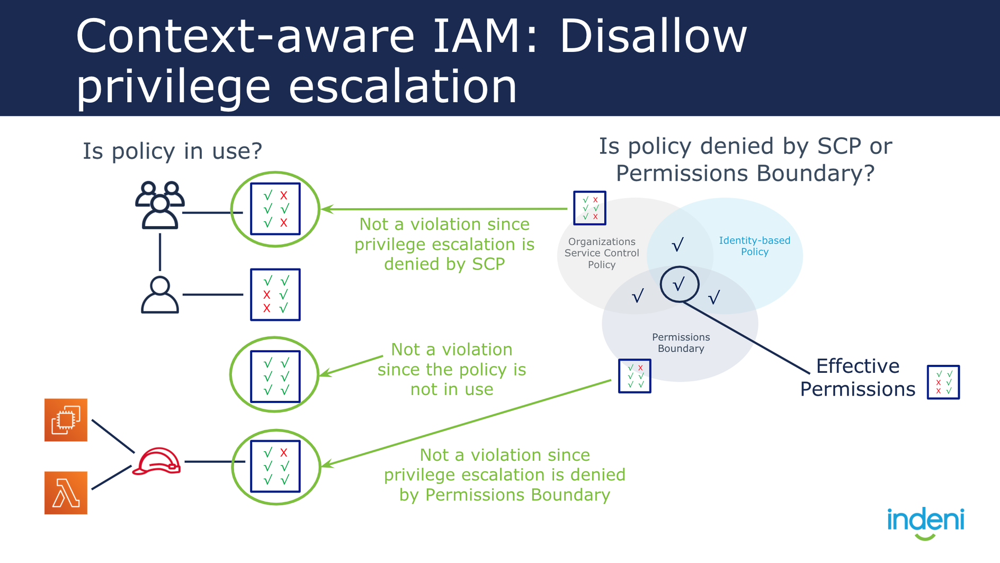
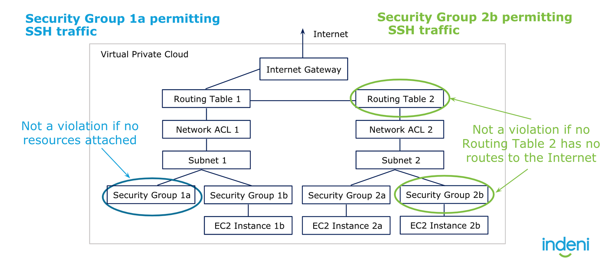

# What is considered a "Context Aware Rule"?

A context aware rule is one where, when it inspects resource A’s configuration for violation, it also must factor resource B's configuration. That is, the configuration of resource B will impact whether a violation is identified in resource A. Note, both Resource A or Resource B may be impacted by additional configuration parameters from other Resources. Those should also be factored into the “Context”. Please note, the “type” of context can be even mixed! For example, it may require both networking and IAM context for a particular CAR that you might have in mind.

Below are some of said examples:

Example 1: Privilege escalations should consider SCP, Permission Boundary, In-line Policy, and IAM Policy. It should also consider whether a resource (in this case a user or resource) intends to use said IAM role.

Example 2: Instances that are routable to the internet should be the only resources considered when analyzing security groups that expose port 22. Additionally, Cloudrail should consider the NACL used by the subnet that the instance belongs to.

