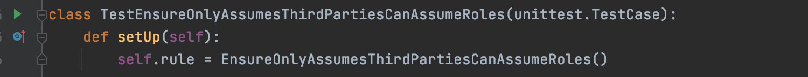

# Tutorial: Writing your own rule

If you're arrived at this page before reading the [overview on rules](../README.md), 
please head there first and come back.

In this tutorial, we'll take you step by step through writing your own Cloudrail rule.

## Prerequisites
* You need to have a basic understanding of Python. You do *not* need an expert level
    understanding.

  
* Install your Python dev tool of choice. In this example, we'll by using PyCharm CE.


## Assumptions
* This tutorial is written assuming you use MacOS, but can work similarly on Linux, Windows, etc.


* We will create a new rule in its own directory. If you want to contribute to the main cloudrail-knowledge
    repository, you should clone the repository instead of setting up your own working directory.

## Scenario

In this tutorial we will be creating a rule which we'll use to list all of the roles that allow
third party access from AWS accounts that haven't been approved yet. The goal is to flush out roles
that were added without going through due process.

## Step 1: Create your work environment

Create a directory where you'll be saving your rules. For example, `~/code/cloudrail-sample-custom-rules`.
In this directory, create a [Python venv](https://docs.python.org/3/tutorial/venv.html), like so:

```
python3 -m venv venv
```

Go into the venv:
```shell
source venv/bin/activate
```

And install the needed Python libraries:
```shell
pip install cloudrail-knowledge
```

Create the `src` (where the rule code will be) and `tests` (where tests will reside) directories:
```
mkdir src
mkdir tests
```

Set up your IDE to the directory you've created. For example, in PyCharm CE, this means
creating a New Project (under the File menu) and selecting the directory you created. PyCharm CE
will recognize the venv you created.

## Step 2: Create the metadata for your rule

All rules must have [metadata](../README.md#Metadata). In the `src` directory, create 
`rules_metadata.yaml` with the required information. Note that the root of the file must
be `rules_metadata`.

```yaml
rules_metadata:
  - cloud_provider: amazon_web_services
    rule_id: ensure_only_approved_third_parties_can_assume_roles
    name: Ensure only approved third party accounts can assume roles
    severity: major
    description: We would like to control which third party accounts can assume roles in our environment.
      This role has an approved-list of accounts which will be expanded over time.
    human_readable_logic: Cloudrail will review all IAM roles' trust policy and look at the accounts allowed.
    remediation_steps_console: Remove the role, or add its account to the approved list in this rule.
    remediation_steps_tf: Remove the aws_iam_role, or add the account to the approved list in this rule.
    rule_type: non_context_aware
    security_layer: iam
    resource_type:
    - iam
```

NOTE: If you're contributing to the cloudrail-knowledge repository, the metadata files already exist. You need
to add to them, depending on the cloud provider the rule applies to, instead of creating a new metadata file.

## Step 3: Create the rule class

The easiest way to do this is by finding an existing rule in the cloudrail-knowledge repository and copying it. Then
clean up the contents of the functions. The rule should be saved as a Python file in the `src` directory.

Your rule should now look like this:

```python
from typing import List, Dict
from cloudrail.knowledge.context.aws.aws_environment_context import AwsEnvironmentContext
from cloudrail.knowledge.rules.base_rule import BaseRule, Issue
from cloudrail.knowledge.rules.rule_parameters.base_paramerter import ParameterType


class EnsureOnlyAssumesThirdPartiesCanAssumeRoles(BaseRule):
    def get_id(self) -> str:
        return 'ensure_only_approved_third_parties_can_assume_roles'

    def get_needed_parameters(self) -> List[ParameterType]:
        return []

    def execute(self, env_context: AwsEnvironmentContext, parameters: Dict[ParameterType, any]) -> List[Issue]:
        issues: List[Issue] = []

        return issues

    def should_run_rule(self, environment_context: AwsEnvironmentContext) -> bool:
        return True
```

NOTE: The get_id needs to return the same id as you picked in the rule's metadata.

## Step 4: Write the logic

Within the execute function, we implement the logic of the rule. For this tutorial, we've
picked this:

```python
    def execute(self, env_context: EnvironmentContext, parameters: Dict[ParameterType, any]) -> List[Issue]:
        issues: List[Issue] = []

        for role in env_context.roles:
            for statement in role.assume_role_policy.statements:
                if statement.effect == StatementEffect.ALLOW:
                    for principal in statement.principal.principal_values:
                        if arn_utils.is_valid_arn(principal) and arn_utils.get_arn_account_id(principal) not in self.approved_list_of_third_parties:
                            issues.append(Issue(f'The IAM role `{role.get_friendly_name()}` has a trust policy that allows account `{ arn_utils.get_arn_account_id(principal)}` '
                                        f'to assume it but that is not in the list of pre-approved third-party accounts', role, role))
        return issues
```

The above code requires that you also add imports at the top of the class:

```python
from cloudrail.knowledge.utils.arn_utils import build_arn
from cloudrail.knowledge.context.aws.iam.policy_statement import StatementEffect
```

The logic here iterates over all the roles in the context (which represents all roles in the 
environment - both those that already exist and those being created). For each role, it iterates
over the assume role policy's statements. For each statement, it looks at the principals included in it.
For each principal, it checks to see if its AWS account ID is in a predetermined list of accounts
we're approving of.

If it's not in the list, we create an Issue with the relevant information.

The list of approved third party accounts is defined like so (add the __init__ function at the top of the
Python class):
```python
    def __init__(self):
        self.approved_list_of_third_parties: List[str] = [
            "645376637575",  # Indeni Cloudrail
            "464622532012",  # DataDog
        ]
```

## Step 5: Update the should_run_rule logic

Before running the rule, the Cloudrail engine will call `should_run_rule` and will only
continue if it returns `True`. Right now, we have it returning `True` always, but we should update
that so it only does so if there are roles to review:

```python
    def should_run_rule(self, environment_context: EnvironmentContext) -> bool:
        return bool(environment_context.roles)
```

There are two reasons to do this:

1. To save on run time, for CPU-intensive rules where the logic might execute even
    when it's not needed.
   

2. More importantly, we do this to signal to the user that the rule applies to their
    environment. If it doesn't, it will be marked as Skipped. This helps users know
    that Cloudrail understands which rules apply, and which don't, to their environment.
   
## Step 6: Add tests

At this point, our rule's code is complete. We now need to add tests.

NOTE: In software development, there's the concept of TDD (test driven development)
where you write the tests first, and then your logic. You can apply that to rule writing
as well. We didn't take that path in this tutorial to make it clearer for the reader.

In the `tests` directory (remember, it's next to the `src` directory), we create our
test class. This is the test we need for the above rule:

```python
import unittest

from cloudrail.knowledge.context.aws.account.account import Account
from cloudrail.knowledge.context.aws.iam.policy import AssumeRolePolicy
from cloudrail.knowledge.context.aws.iam.policy_statement import PolicyStatement, StatementEffect
from cloudrail.knowledge.context.aws.iam.principal import Principal, PrincipalType
from cloudrail.knowledge.context.aws.iam.role import Role
from cloudrail.knowledge.context.aws.aws_environment_context import AwsEnvironmentContext
from cloudrail.knowledge.rules.base_rule import RuleResultType
from src.ensure_only_approved_third_parties_can_assume_roles import EnsureOnlyAssumesThirdPartiesCanAssumeRoles


class TestEnsureOnlyAssumesThirdPartiesCanAssumeRoles(unittest.TestCase):
    def setUp(self):
        self.rule = EnsureOnlyAssumesThirdPartiesCanAssumeRoles()

    def test_ensure_only_approved_third_parties_can_assume_roles_fail(self):
        # Arrange
        context = AwsEnvironmentContext()

        account = Account("a", "b", False)
        context.accounts.append(account)

        role = Role("a", "don't know", "not_approved_role", [], "not_approved_role", None, None)
        context.roles.append(role)

        principal = Principal(principal_type=PrincipalType.AWS, principal_values=["arn:aws:iam::123456789012:root"])

        role_assume_policy = AssumeRolePolicy(
            account.account_name, role.role_name,
            role.arn, [PolicyStatement(
                StatementEffect.ALLOW,
                ["assume role etc"],
                ["*"],
                principal,
                'test123', )], "")
        role.assume_role_policy = role_assume_policy

        # Act
        result = self.rule.run(context, {})

        # Assert
        self.assertEqual(RuleResultType.FAILED, result.status)
        self.assertEqual(1, len(result.issues))

    def test_ensure_only_approved_third_parties_can_assume_roles_pass(self):
        # Arrange
        context = AwsEnvironmentContext()

        account = Account("a", "b", False)
        context.accounts.append(account)

        role = Role("a", "don't know", "approved_role", [], "approved_role", None, None)
        context.roles.append(role)

        principal = Principal(principal_type=PrincipalType.AWS, principal_values=["arn:aws:iam::645376637575:root"])

        role_assume_policy = AssumeRolePolicy(
            account.account_name, role.role_name,
            role.arn, [PolicyStatement(
                StatementEffect.ALLOW,
                ["assume role etc"],
                ["*"],
                principal,
                'test123', )], "")
        role.assume_role_policy = role_assume_policy

        # Act
        result = self.rule.run(context, {})

        # Assert
        self.assertEqual(RuleResultType.SUCCESS, result.status)
        self.assertEqual(0, len(result.issues))
```

Let's look at a few things here:

1. Note the `setUp` function declares the rule we're testing against.
2. There are two test functions one for `_fail` and one for `_pass`. The idea is 
    that we test the rule catching a violation ("fail") and the rule not catching a violation
   (because the configuration is ok - which is a "pass").
3. In each test function, we "build" a mock context that the rule runs against.
   This is important to understand - we're actually creating here the objects that
   Cloudrail would normally create as part of the context building. We do this in
   order to make this truly a unit-test, where the rule is tested against mock
   content.
4. If you compare the test functions, notice the `principal` defined and what 
    AWS account ID it's using.
   
Generally, you'd want to try and add as many test cases as makes sense, to simulate
different scenarios.

**QUESTION:** Why can't I just supply a Terraform code to test again?

**ANSWER:** Our context has multiple sources of input, including multiple live environments
(cloud accounts) and one or more infrastructure-as-code languages. The building phase
in our context translates all of these sources into our central context model. Testing
of our context is done in a separate, private, repository. So when testing rules, you should
assume the translation from those different sources of input is already done, and you can
rely on the context to be built.

## Step 7: Run unit tests

Now, you should run the test class. In PyCharm, it's as easy as clicking on the 
green arrow to the left of the test class's name:



If you've done everything correctly, the tests should pass. If they fail, click on
the failed test and look at the log to see what may be wrong.

## Step 8: Run an end-to-end test on your rule

Want to see what kind of output Cloudrail will _actually_ generate for your rule? Follow
these steps:

1. Create a main.tf that simulates the issue you want to catch. In our example, this
    would work:
   
```hcl
provider "aws" {
  region = "us-east-1"
}

resource "aws_iam_role" "myexample" {
  name = "myexample"
  assume_role_policy = <<EOF
{
  "Version": "2012-10-17",
  "Statement": [
    {
      "Sid": "",
      "Effect": "Allow",
      "Principal": {
        "AWS": "arn:aws:iam::111122223333:user/LiJuan"
      },
      "Action": "sts:AssumeRole"
    }
  ]
}
EOF
}
```

2. Generate a plan for the above file (`terraform init`, `terraform plan -out=plan.out`).


3. Run Cloudrail with this plan, using your custom rule:

```shell
docker run --rm -it  -v $PWD:/data -v cloudrail:/indeni indeni/cloudrail-cli run -p plan.out --auto-approve -v --custom-rules src
```
Note the `--custom-rules` at the end, with the directory where the rule is located.

Your results should look like this:

```
✔ Reading custom rules...
✔ Preparing a filtered Terraform plan locally before uploading to Cloudrail Service...
✔ Re-running your Terraform plan through a customized 'terraform plan' to generate needed context data...
✔ Filtering and processing Terraform data...
✔ Obfuscating IP addresses...
✔ Submitting Terraform data to the Cloudrail Service...
✔ Your job id is: 4a2924aa-378e-47b0-8340-ed7e97071760
✔ Building simulated graph model, representing how the cloud account will look like if the plan were to be applied...
✔ Running context-aware rules...
✔ Running custom rules...
✔ Returning results, almost done!
✔ Assessment complete, fetching results...
WARNINGs found:
Rule: Ensure only approved third party accounts can assume roles
 - 1 Resources Exposed:
-----------------------------------------------
   - Exposed Resource: [aws_iam_role.myexample] (main.tf:5)
     Violating Resource: [aws_iam_role.myexample]  (main.tf:5)
     Evidence:
             | The IAM role aws_iam_role.myexample has a trust policy that allows account 111122223333 to assume it but that is not in the list of pre-approved third-party accounts
```

## Wrap it up

That's it for the rule development. You can now either submit it as a PR to cloudrail-knowledge,
or save it in your own repository for use with Cloudrail. 

## Parting notes

By default, Cloudrail will only show violations for resources that are managed in infrastructure-as-code. If, for your rule,
you want it to show violatiosn for all resources, even those that only existing in the live environment,
add this to your rule:

```python
    @staticmethod
    def filter_non_iac_managed_issues() -> bool:
        return False
```